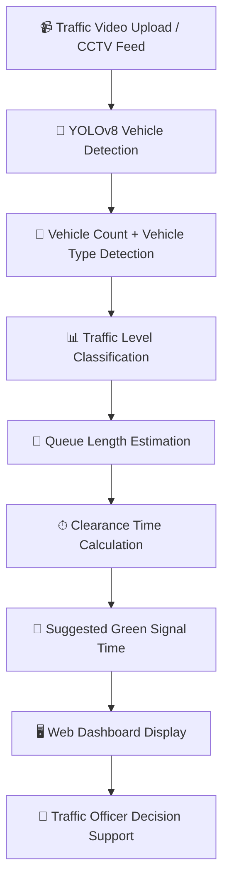

# 🚦 TrafficEye — Vehicle Density Monitor

Real-time traffic analysis using YOLOv8 + OpenCV + FastAPI.

---
The real-world problem is:

Traffic officers and road authorities often lack an intelligent system that can estimate real traffic congestion conditions and provide practical traffic-management support in real time.

✅ Proposed Solution

TrafficEye is an AI-powered traffic monitoring and decision-support system that uses a YOLOv8 object detection model to analyse traffic videos and estimate traffic congestion conditions.

The system:

Detects vehicles from traffic video footage
Counts detected vehicles in real time
Classifies traffic levels
Estimates queue length
Calculates traffic clearance time
Suggests green signal duration for traffic officers


## 📁 Project Structure

```
traffic-monitor/
├── backend/
│   ├── main.py            ← FastAPI server + YOLO detection
│   └── requirements.txt
└── frontend/
    └── index.html         ← Web dashboard (no build needed)
``` 

## 🧩 Overall System Flow


---

## ⚙️ Setup & Run

### Step 0 — python venv
*create the environmnet (do this only at the 1st time run)

Windows:
```bash
cd backend
python -m venv myfirstproject
```

macOS/Linux:
```bash
cd backend
python -m venv myfirstproject
```

*Activate the venev (do this evrytime before run)
Windows:
```bash
cd backend
myfirstproject\Scripts\activate
```

macOS/Linux:
```bash
cd backend
source myfirstproject/bin/activate
```


### Step 1 — Install Python dependencies

```bash
cd backend
pip install -r requirements.txt
```


### Step 2 — Start the backend server

```bash
cd backend
uvicorn main:app --reload --host 0.0.0.0 --port 8000
```

You should see:
```
✅ YOLOv8 loaded
INFO:     Uvicorn running on http://0.0.0.0:8000
```

### Step 3 — Open the frontend

Just open `frontend/index.html` in your browser.  
*(Chrome recommended for best WebSocket performance)*

### Step 4 — Use the app

1. **Drag & drop** a traffic video onto the upload zone
2. Click **▶ START** to begin analysis
3. Watch real-time:
   - Bounding boxes around detected vehicles
   - Vehicle count per frame
   - Traffic level: CLEAR / LOW / MEDIUM / HIGH
   - FPS counter and progress bar
   - Detection breakdown by vehicle type

---

## 🎛️ Traffic Level Thresholds

| Level  | Vehicle Count | Color  |
|--------|--------------|--------|
| CLEAR  | 0            | 🟢 Green |
| LOW    | 1–4          | 🟢 Light green |
| MEDIUM | 5–10         | 🟡 Yellow |
| HIGH   | 11+          | 🔴 Red |

**Tune these** in `backend/main.py` → `get_traffic_level()` based on your road.

---

✅ Dashboard Features

📹 Uploaded video preview
🚗 Live vehicle count
🚦 Current traffic level
📊 Detection breakdown list
📈 Traffic history chart
📏 Queue length display
⏱ Clearance time display
🚦 Suggested green time
⏳ Countdown timer
📡 Real-time updates via WebSocket

📚 System Workflow Summary

Traffic Video / CCTV Feed
        ↓
YOLOv8 Vehicle Detection
        ↓
Vehicle Count + Vehicle Type Detection
        ↓
Traffic Level Classification
        ↓
Queue Length Estimation
        ↓
Clearance Time Calculation
        ↓
Suggested Green Signal Time
        ↓
Traffic Officer Decision Support

## 🔧 Configuration

### Change confidence threshold
```python
results = model(frame, verbose=False, conf=0.4)  # lower = more detections
```

---


